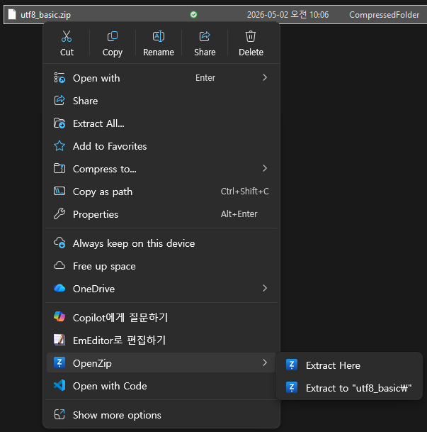
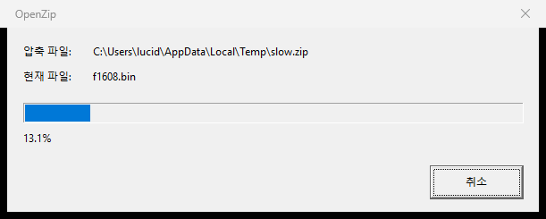
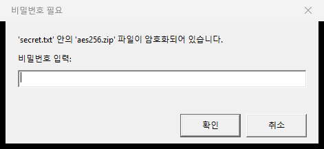
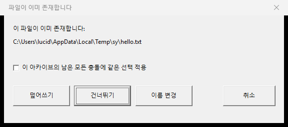

# OpenZip

A minimal, fast ZIP utility for Windows with native Explorer context-menu integration.

> 한국어 ZIP 파일 (CP949)을 깨짐 없이 다루는 가벼운 Windows 압축/해제기.

## Features

- **Modern Win11 + classic Win10 context menus** — extract and compress verbs appear in Win11's modern right-click menu and (on Win10 1903+) in the classic shell menu. The classic handler self-suppresses on Win11 to avoid duplication.
- **Compress from Explorer** — right-click any file/folder → OpenZip → compress to `<name>.zip`, compress each separately, or open the options dialog (level / password / output path).
- **Correct Korean filenames** — robust CP949 / UTF-8 detection on extract; selectable UTF-8 (default) or CP949 output on compress.
- **Password support** — read both ZipCrypto and AES-256; write AES-256 encrypted archives when a password is set.
- **Dark mode** — all dialogs follow the OS theme on Win11.
- **Fast** — minizip-ng + zlib-ng under the hood, parallel extraction, single-instance queue prevents disk thrash.
- **Safe** — Zip-slip, symlink, decompression-bomb, and Windows reserved-name protections built in. Compression writes atomically (`.partial` → rename) so a cancel or crash never leaves a half-written archive.
- **Light** — ZIP only; no preview UI, no telemetry, no auto-update.

## Download

- **Microsoft Store** (recommended; auto-updates, signed): https://www.microsoft.com/store/apps/9P09P5W5DPK0 *(v0.3.0 pending review)*
- **GitHub Releases** (sideload `.msix`): https://github.com/vitaldb/openzip/releases/latest
- **Project page**: https://vitaldb.github.io/openzip

Sideload install (Developer Mode on Windows required):

```powershell
Add-AppxPackage .\OpenZip_0.3.0.msix
```

System requirements: Windows 10 1903 (build 18362) or later, or Windows 11. x64 only.

## Screenshots

### Modern context menu

Right-click any `.zip` in File Explorer → **OpenZip** appears in the modern menu (no "Show more options" needed):



### Progress dialog (Korean UI on Korean systems)

The dialog auto-localizes when the user's MUI or regional locale is Korean:



### Password prompt (ZipCrypto / AES-256)

Encrypted archives prompt for the password before the first encrypted entry:



### Conflict resolution

If the destination already has a file, choose Overwrite / Skip / Rename / Cancel — with optional "apply to all":



## Build from source

Prerequisites:
- Visual Studio 2022 with MFC and C++/CLI components
- Windows 10/11 SDK (latest)
- vcpkg integrated with VS (manifest mode)
- Python 3.10+ (for MSIX packaging script)

```powershell
git clone https://github.com/vitaldb/openzip.git
cd openzip
msbuild OpenZip.sln /p:Configuration=Release /p:Platform=x64
python msix\build_msix.py 0.3.0
# Sideload (Developer Mode required):
Add-AppxPackage -Register .\msix\staging\AppxManifest.xml
```

To run the unit tests:

```powershell
.\x64\Debug\CoreTests.exe
```

## Releasing

Maintainers cut a release with one command (requires the [GitHub CLI](https://cli.github.com)):

```powershell
python tools\deploy.py 0.3.0
```

This builds Release|x64, packages the MSIX, tags `v0.3.0`, creates the GitHub
release, and uploads the `.msix` as the release asset. CI is intentionally not
used — see `tools/deploy.py` for rationale.

## Architecture

| Component | Type | Purpose |
|---|---|---|
| `OpenZipCore` | static lib | Extraction + compression engine, filename decoding, path validation |
| `OpenZipApp` | MFC EXE | Progress UI, password prompt, conflict and compress-options dialogs, dark-mode helper |
| `OpenZipShellExt` | Win32 DLL | `IExplorerCommand` for Win11 modern context menu (extract + compress) |
| `OpenZipShellExtClassic` | Win32 DLL | `IContextMenu` + `IShellExtInit` for Win10 classic menu (Win11 OS-gate self-suppresses) |

See [`plan.md`](./plan.md) for the original design rationale and [`docs/superpowers/specs/`](./docs/superpowers/specs/) for v0.3's compress + Win10 spec.

## License

MIT — see [LICENSE](./LICENSE).

Third-party libraries:
- [minizip-ng](https://github.com/zlib-ng/minizip-ng) — zlib license
- [zlib-ng](https://github.com/zlib-ng/zlib-ng) — zlib license

## Credits

Developed by the [VitalDB](https://vitaldb.net) lab at Seoul National University Hospital.
